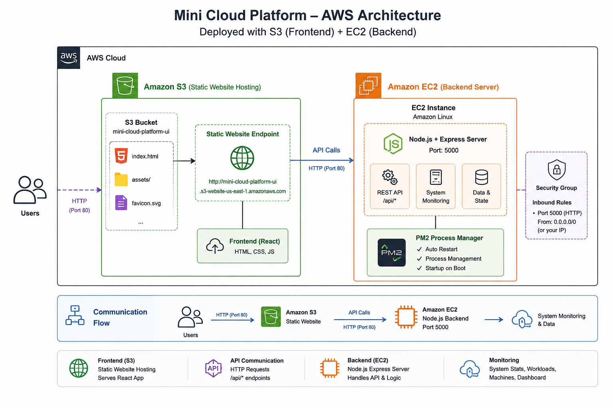

# Mini Cloud Platform

A cloud-native platform for machine monitoring and workload deployment.

## AWS Deployment Architecture

## Features

- Machine Monitoring
- Workload Deployment
- Resource Allocation
- Heartbeat Tracking